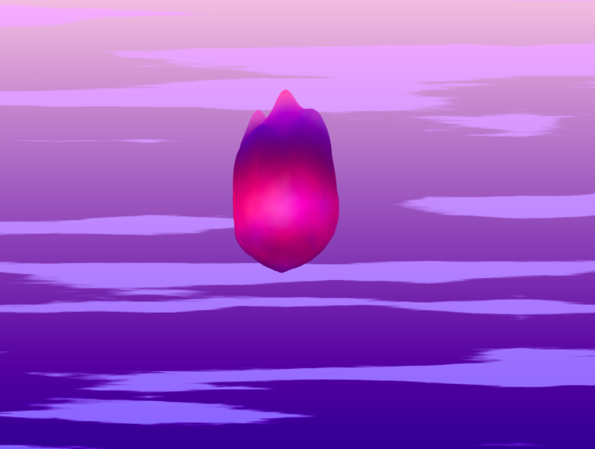

# [Project 1: Noise](https://github.com/CIS-566-Fall-2022/hw01-fireball-base)

## Fireball
Link: https://terskayl.github.io/hw01-fireball/ 
This is my fireball:  
  

I pulled out a bunch of points on top using similarities to a dot product for randomized directions.
I used fbm to create smaller noise. It also influences the color
The color is also influenced by how far away a point is in both object space and screen space from the center of the fireball.  

The background is made using two gradients mixed by fbm noise.  

 I used multidimensional linear interpolation, e.g. in interpolatedNoise() in lambert-vert line 55, sin and cos functions, e.g. lambert-vert line 115, bias, e.g. lambert-vert line 132, and smoothstep, e.g. flat-frag line 66
